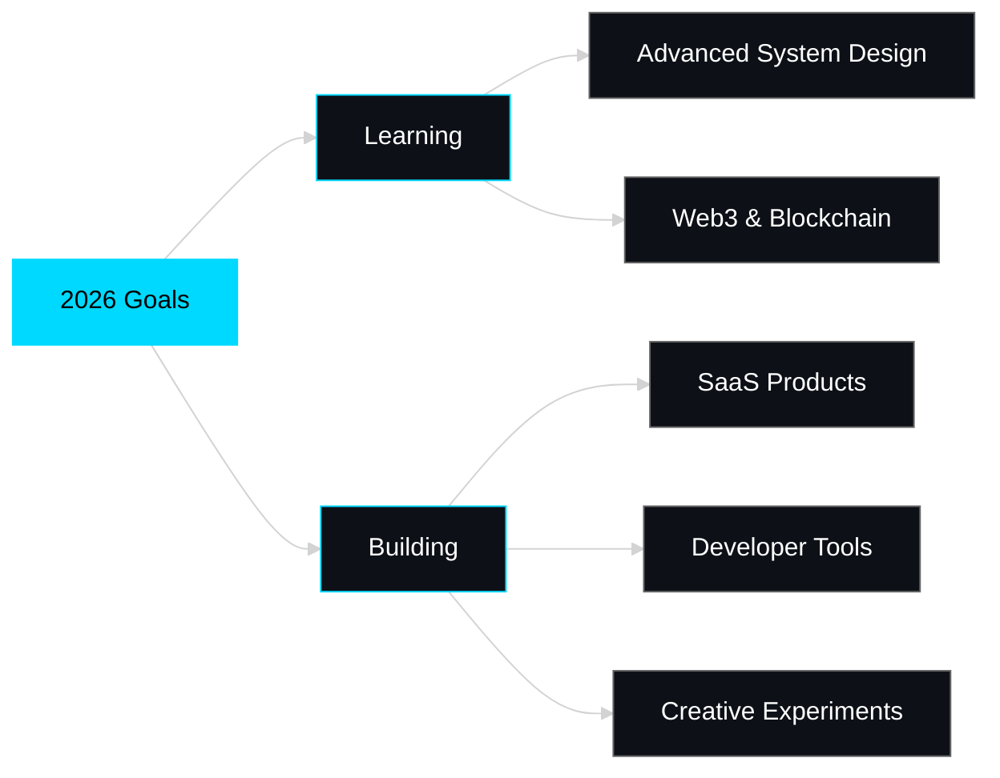

<div align="center">

# ⚡ LASANTHA PRADEEP

### `Full Stack Developer` • `Cloud & DevOps Consultant`

[](https://git.io/typing-svg)

</div>


## 🎯 WHO AM I

<table align="center">
<tr>
<td width="50%">

```go
package main

type Developer struct {
    Name        string
    Location    string
    Role        []string
    Expertise   []string
    Philosophy  string
}

func main() {
    me := Developer{
        Name:     "Lasantha Pradeep",
        Location: "🌍 Earth",
        Role: []string{
            "Full Stack Developer",
            "Cloud & DevOps Consultant",
        },
        Expertise: []string{
            "TypeScript/JavaScript/Go/PHP",
            "React/Next.js/Angular",
            "AWS/GCP Cloud Architecture",
            "REST/SOAP APIs",
            "CI/CD & DevOps",
        },
    }
}
```

</td>
<td width="50%">


### 🚀 Quick Facts

- 🔭 Building scalable cloud-native applications
- 🌱 Deep diving into System Design
- ⚡ Passionate about developer tools & automation
- 💬 Ask me about AWS, Docker, or Linux

</td>
</tr>
</table>


## 🔥 TECH STACK

<div align="center">

| Category | Technologies |
|----------|-------------|
| **Languages** |     |
| **Frontend** |     |
| **Backend** |     |
| **Cloud & DevOps** |      |

</div>


## 📈 GITHUB STATISTICS

<div align="center">
  


</div>

<div align="center">
  
[](https://git.io/streak-stats)

</div>

<div align="center">

[](https://github.com/ashutosh00710/github-readme-activity-graph)

</div>


## 🎯 2026 ROADMAP

<div align="center">



</div>


## 💡 DAILY INSPIRATION

<div align="center">


</div>


## 🌐 CONNECT WITH ME

<div align="center">

[](https://linkedin.com/in/lasantha-pradeep)
[](https://x.com/lasantha-pradeep)
[](mailto:contact.lasanthapradeep@gmail.com)


</div>


<div align="center">

### ⚡ *"Simplicity is the ultimate sophistication"* - Leonardo da Vinci

**Made with 💙 by [Lasantha Pradeep](https://github.com/lasantha-pradeep)**

</div>
